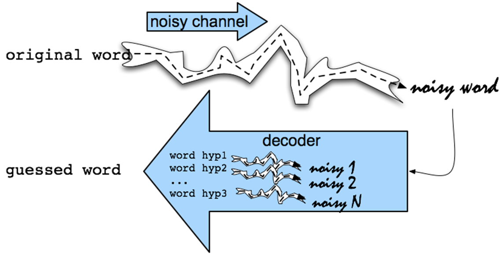

# Urdu-Spell-Checker-using-Noisy-Channel-Model
It is Python Implementation of Word Spell Checker. Currently it is trained on Urdu/Hindi Dataset but you may train it on any language just by changing the path of corpus file and adding the charachter list of Language.
END-to-END NLP application development forspell checker using Noisy channel model

Noisy channel first creates all the possible One Edit distant/two edit distant candidates then filter only those candidates those are real words in your dictionary and remove all other. Then find the bigram/trigram gram probability to find the most probable word to replace by this unreal word.

In Urdu Spell Checker.ipynb, cell#7 contains the following code:

      with open('./jang_errors.txt',encoding='utf-8') as f:
      err_lines = f.readlines()
      with open('./jang_nonerrors.txt',encoding='utf-8') as f:
          correct_lines = f.readlines()
          
          
1st line contains the path of file having sentences which includes the error words.
3rd line contains the path of file having those sentences without any error. This file is just to compare the results at the end.

In Urdu Spell Checker.ipynb, cell#9 contains the following code:

      urdu_char='ضزڑگصحًھٹِنپتمکہچرفسآدڈغثظبَُقطذےخلءںشعژّوئیاؤج'
      
This is the character seet of a language, like in case of English it should be something like this:

     urdu_char='ABCDEFGHIJKLMNOPQRSTUVWXYZ'
     
Ready to make your own word spell checker using NOISY Channel Approch.
